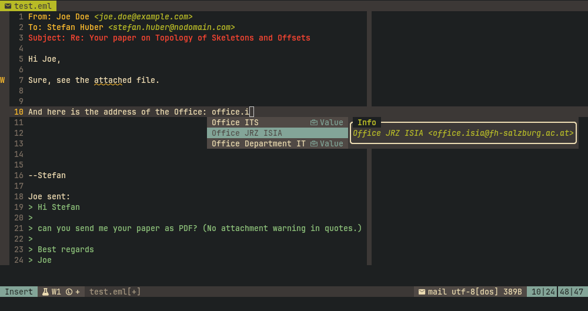

# mailassist.nvim

**Mailassist** is a Neovim plugin to assist with composing emails, providing
features such as attachment reminders, contact completion, and easy attachment
header insertion. Users will typically use a text-based mail client (MUA) like
mutt or Neomutt and Neovim for mail composing.

## Features

- **Attachment Checker:** Warns you if you mention an attachment in your email
  body but forget to add an `Attach:` header.
- **Anger Checker:** Warns you if you mention some inappropriate keywords.
- **Attach Header Insertion:** Quickly insert an `Attach:` header with a file
  prompt.
- **Contact Completion:** Provides LSP-powered completion for email addresses
  and names from various sources:
  - Mutt alias files
  - Khard address book
  - Notmuch address database
- **Signature completion:** Provides LSP-powered completion for mail
  signatures.
- **Configurable Keymaps:** Default keymaps for common actions, with the
  ability to disable or customize.

It leverages modern Neovim facilities, like the diagnostics framework for the
attachment warning and it implements an in-process LSP server for completion
tasks.

<p align="center">  </p>

## Installation

Use your favorite plugin manager. For example, with [lazy.nvim](https://github.com/folke/lazy.nvim):

```lua
{
  "yourusername/mailassist.nvim",
  config = function()
    require("mailassist").setup()
  end,
  ft = "mail",
}
```

## Usage

Just compose your mail. When you use a keyword for attachment then a diagnostic
warning will be placed and upon the first completion trigger the contact
database is loaded lazily. You need a completion plugin, like
[mini.complete](https://github.com/nvim-mini/mini.completion).

Different trigger characters affect the completion results:
- The trigger character `<` causes an email completion.
- The trigger character `@` causes a name completion.
- The trigger character `-` causes a signature completion.

Without a trigger character, the context affects the results:
- At `From:` header line, from addresses are completed.
- At the end of the file, signatures are completed.
- Otherwise contacts are completed.

The default keymaps are as follows:
- `<C-a>` (insert/normal mode): Prompt to add an `Attach:` header.
- `<localleader>ma`: Add an `Attach:` header.
- `<localleader>mk`: Toggle khard contacts.
- `<localleader>mm`: Toggle mutt alias contacts.
- `<localleader>mn`: Toggle notmuch contacts.


## Configuration

Call `require("mailassist").setup({ ... })` with your options. The default options are:

```lua
require("mailassist").setup({
  -- Enable or disable default keymaps.
  add_default_keymaps = true,

  -- Options concerning warnings:
  -- Keywords that indicate an attachment is mentioned in the email body. Set to empty list
  -- to disable attachment warning.
  attach_keywords = { 'attach', 'enclosed', 'pdf' },
  -- Keywords indicating aggressive language
  anger_keywords = {},
  -- Attach warning does not apply to quotation lines. Set the start-quotation symbols here.
  quote_symbols = '>|',

  -- Options for contact completion:
  -- Manually injecting contacts
  inject_contacts = {},
  -- Files to load contacts from mutt aliases.
  mutt_alias_files = { '~/.mutt/alias', },
  -- Load contacts from various sources unconditionally.
  contacts_load_mutt_aliases = true,
  -- Load contacts from khard unconditionally
  contacts_load_khard = true,
  -- Load contacts from notmuch unconditionally
  contacts_load_notmuch = false,

  -- Options for signature completion:
  -- Manually injecting contacts
  inject_signatures = {},
  -- Directories to load signatures from
  signature_dirs = { '~/.mutt/signatures' },

  -- Options for from completion:
  -- Manually injecting contacts
  inject_fromaddresses = {},
  -- Files to load 'from = "address"' lines from
  from_source_files = { '~/.mutt/muttrc' },
})
```

Contacts and signatures can be injected into the database by passing a table
like this:
```lua
local contacts = {
  { alias = 'alice',           email = 'alice@example.org' },
  { alias = 'board',           email = 'alice@example.org, bob@example.org, cesar@example.org' },
  { name = 'Alice Wonder',     email = 'alice@example.org' },
  { email = 'dave@example.org' },
}

local signatures = {
  { label = 'home', signature = 'Your name\nYour home' },
  { label = 'work', signature = 'Your name\nYour company' },
}

require('mailassist').setup({
  attach_keywords = { 'attach', 'enclosed', 'pdf', 'anhang', 'angehängt' },
  inject_contacts = contacts,
  inject_signatures = signatures
})
```

Note that the `@` tigger will not complete `dave@example.org`, as it has no
`name` or `alias`. In order to change the default keymaps, adapt the key
bindings in the default mapping below:

```lua


function M.default_keymaps()
  vim.keymap.set({ 'i', 'n' }, '<C-a>', M.attach_file, { desc = 'Add Attach: header' })
  vim.keymap.set({ 'n' }, '<localleader>ma', M.attach_file, { desc = 'Add Attach: header' })
  vim.keymap.set({ 'n' }, '<localleader>mk', M.toggle_contacts_khard, { desc = 'Toggle khard contacts' })
  vim.keymap.set({ 'n' }, '<localleader>mm', M.toggle_contacts_mutt_aliases, { desc = 'Toggle mutt alias contacts' })
  vim.keymap.set({ 'n' }, '<localleader>mn', M.toggle_contacts_notmuch, { desc = 'Toggle notmuch contacts' })
end

```

## Requirements

- Neovim 0.10+
- Optional: [khard](https://github.com/scheibler/khard),
  [notmuch](https://notmuchmail.org/), [Mutt](http://www.mutt.org/)
  or [NeoMutt](https://neomutt.org/)

## Similar plugins

- [vim-mail](https://github.com/dbeniamine/vim-mail) also provides contact
  completion, and much more, like mail sending, quick header navigation.
